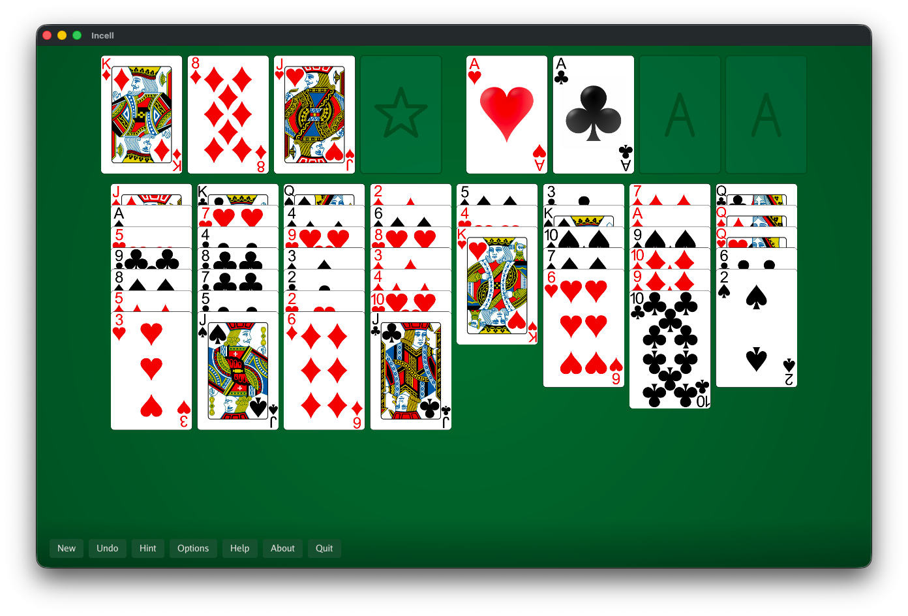

# Incell


FreeCell with a twist.



## Installation

### macOS (Homebrew)

```bash
brew tap kluzzebass/tap
brew install --cask incell
```

### From source

Requires Go 1.23 or later.

```bash
go install github.com/kluzzebass/incell/cmd/incell@latest
```

## How to Play

Move all 52 cards to the four foundation piles, building each suit from Ace to King.

- **4 Free Cells** (top left): Temporary storage for single cards
- **4 Foundations** (top right): Build up by suit from Ace to King
- **8 Tableau columns**: Build down by alternating colors

Click a card to automatically move it to the best available position, or drag cards to move them manually.

## License

MIT

---

© 2026 Jan Fredrik Leversund
